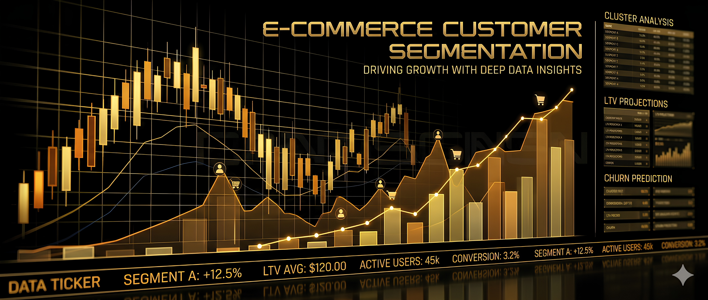

# Project 1 - Customer Segmentation

## Goal

Segment customers into distinct groups based on behavioral and demographic data to enable targeted marketing strategies.

## Objectives
1. Define the Problem & Goals
2. Data Collection & Cleaning
3. Exploratory Data Analysis (EDA)
4. Feature Selection & Engineering
5. Unsupervised Learning – Clustering
6. Analyze Cluster Profiles

